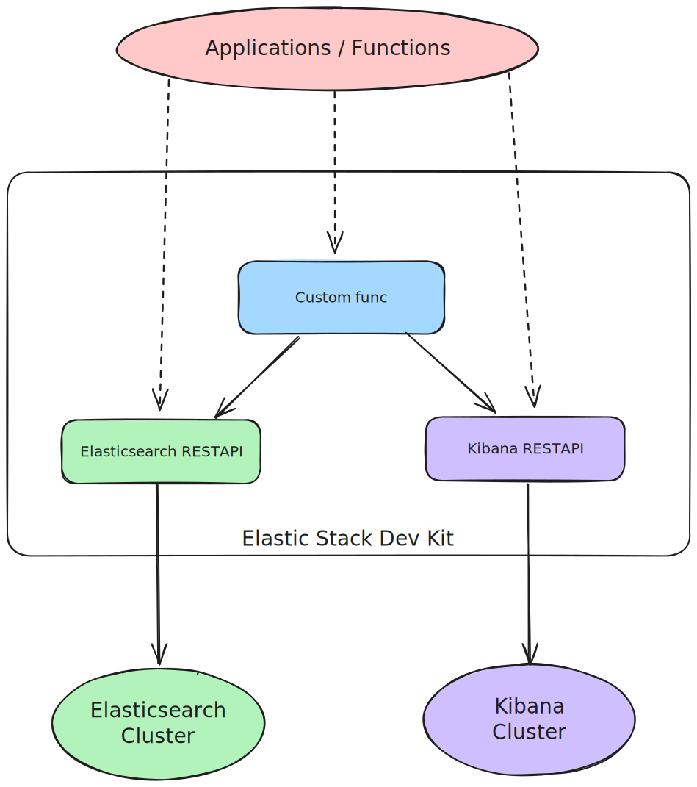

# Elastic Stack Dev Kit

Elastic Stack Dev Kit is a toolkit for efficiently developing, testing, and optimizing Elastic Stack solutions with
pre-configured environments and automation scripts.

## Workflow

## Features

- Use case-driven custom services.
- Seamless integration with the core features of the Elastic Stack.
- REST API-based, compatible with Elasticsearch cluster updates without library version dependency.

## Elastic Stack Documentation

- [Kibana](https://www.elastic.co/docs/api/doc/kibana/)
- [Elasticsearch](https://www.elastic.co/docs/api/doc/elasticsearch/)